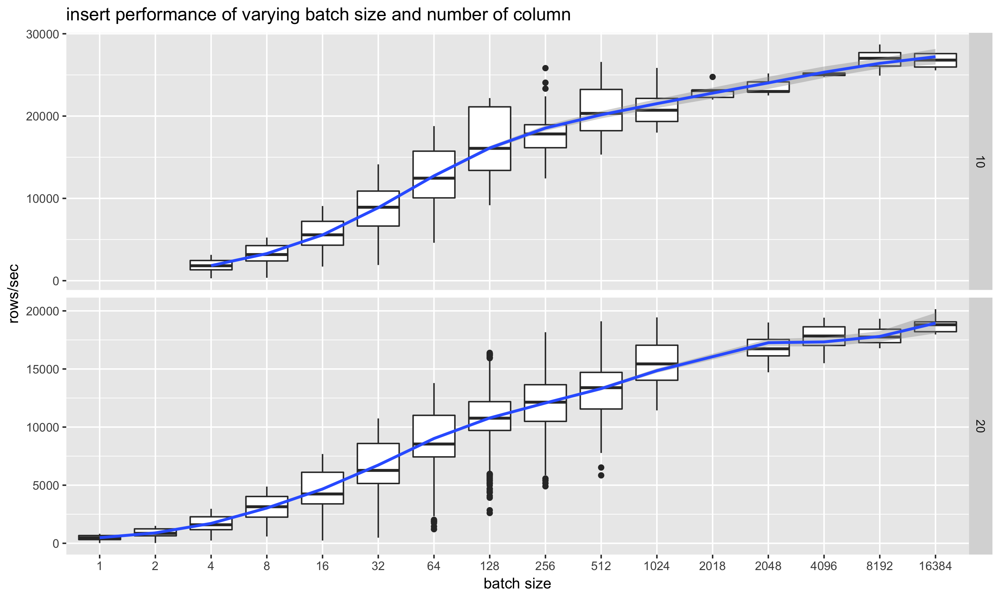

In a distributed system, network latency is a large contributor of performance bottleneck.  
Getting more unit of work done per request helps increase throughput performance.

The follow graph shows:
- x-axis varying the batch size -- how many rows were inserted per each request (from 1 to 16K )
- y-axis shows the corresponding increase in throughput.  
- as the numner of columns in the table increase from 10 to 20, the throught decreases as more data has to be moved.
  
