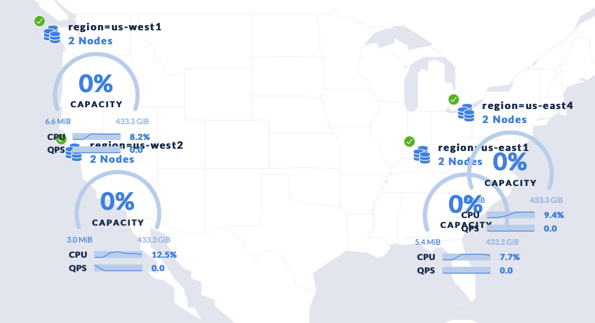

# Steps 

- install [roachprod](https://github.com/cockroachdb/cockroach/tree/master/pkg/cmd/roachprod). Please refer to [full instructions](https://github.com/cockroachdb/cockroach/blob/master/CONTRIBUTING.md).  TLDR below:

```
mkdir -p $(go env GOPATH)/src/github.com/cockroachdb
cd $(go env GOPATH)/src/github.com/cockroachdb
git clone https://github.com/cockroachdb/cockroach
cd cockroach
make bin/roachprod
```
- Copy and Paste each line from one of the topologies below:

Script | Description 
------ | ----------- 
ycsb-1region.sh              | Single region
ycsb-3region-2az-5replica.sh | 3 Regions, 2 Availabiity Zones per Region, 5 Replicas
ycsb-3region-2az-5replica.sh | 3 Regions, 2 Availabiity Zones per Region, 5 Replicas




- Copy and Paste each line from [ycsb-roachprod.sh](https://github.com/robert-s-lee/crdbexamples/blob/replica-lease/scripts/ycsb-roachprod.sh)

## Failover

When a node fails, haproxy will automatically reconnect to a new CRDB node.  JDBC driver and YCSB do not have logic to reconnect automatically. The reconnect is initiated by stopping and restarting YCSB.  haproxy takes about one second to reconnect. Once the watchdog detects connection failure, it will stop, wait 5 seconds to allow haproxy to switch over, then restart YCSB.

The watchdog looks for ```^Error``` in the stderr. 

## Schema

Default schema.

```
CREATE TABLE usertable (
  ycsb_key VARCHAR NOT NULL,
  field0 VARCHAR NULL,
  field1 VARCHAR NULL,
  field2 VARCHAR NULL,
  field3 VARCHAR NULL,
  field4 VARCHAR NULL,
  field5 VARCHAR NULL,
  field6 VARCHAR NULL,
  field7 VARCHAR NULL,
  field8 VARCHAR NULL,
  field9 VARCHAR NULL,
  CONSTRAINT "primary" PRIMARY KEY (ycsb_key ASC)
  ); 
```
## Partition

_ycsb_part creates partion for each node in the cluster. 

```
ALTER TABLE PARTITION BY RANGE (ycsb_key) (
  PARTITION user0 VALUES FROM (MINVALUE) TO ('user001'),
  PARTITION user1 VALUES FROM ('user001') TO ('user002'),
  PARTITION user2 VALUES FROM ('user002') TO ('user003'),
  PARTITION user3 VALUES FROM ('user003') TO ('user004'),
  PARTITION user4 VALUES FROM ('user004') TO ('user005'),
  PARTITION user5 VALUES FROM ('user005') TO ('user006'),
  PARTITION usermaxvalue VALUES FROM ('user006') TO (MAXVALUE)
);
```

## Replica and Leaseholder

```
ALTER PARTITION user0 OF TABLE defaultdb.usertable CONFIGURE ZONE USING constraints='{"+region=europe-west1":1,"+region=europe-west2":1,"+region=europe-west3":1}', lease_preferences='[[+region=europe-west1],[+region=europe-west2],[+region=europe-west3]]';
ALTER PARTITION user1 OF TABLE defaultdb.usertable CONFIGURE ZONE USING constraints='{"+region=europe-west2":1,"+region=europe-west3":1,"+region=europe-west1":1}', lease_preferences='[[+region=europe-west2],[+region=europe-west3],[+region=europe-west1]]';
ALTER PARTITION user2 OF TABLE defaultdb.usertable CONFIGURE ZONE USING constraints='{"+region=europe-west3":1,"+region=europe-west1":1,"+region=europe-west2":1}', lease_preferences='[[+region=europe-west3],[+region=europe-west1],[+region=europe-west2]]';
ALTER PARTITION user3 OF TABLE defaultdb.usertable CONFIGURE ZONE USING constraints='{"+region=europe-west1":1,"+region=europe-west3":1,"+region=europe-west2":1}', lease_preferences='[[+region=europe-west1],[+region=europe-west3],[+region=europe-west2]]';
ALTER PARTITION user4 OF TABLE defaultdb.usertable CONFIGURE ZONE USING constraints='{"+region=europe-west2":1,"+region=europe-west3":1,"+region=europe-west1":1}', lease_preferences='[[+region=europe-west2],[+region=europe-west3],[+region=europe-west1]]';
ALTER PARTITION user5 OF TABLE defaultdb.usertable CONFIGURE ZONE USING constraints='{"+region=europe-west3":1,"+region=europe-west2":1,"+region=europe-west1":1}', lease_preferences='[[+region=europe-west3],[+region=europe-west2],[+region=europe-west1]]';
```
## variables to override behavior

### DDL control

Env Variable | Default | Description 
------ | ----------- | -----------
_ycsb_db          | defaultdb | database name where the table is located.  
_ycsb_fieldcount  | 10        | the number of columns in the table starting with FIELD0
_ycsb_pkeycount   | 0         | aside from YCSB_KEY, the number of addtional keys in the primary key starting from FIELD0
_ycsb_secondindex | 0         | the number of secondary indexs starting with FIELD0
_ycsb_family      | 0         | the number of fields in separate column family starting from FIELD0

### DML control

Env Variable | Default | Description 
------ | ----------- | -----------
_ycsb_batchsize          | 128 | batchsize.  should be power of 2.  use 1 for no batching
